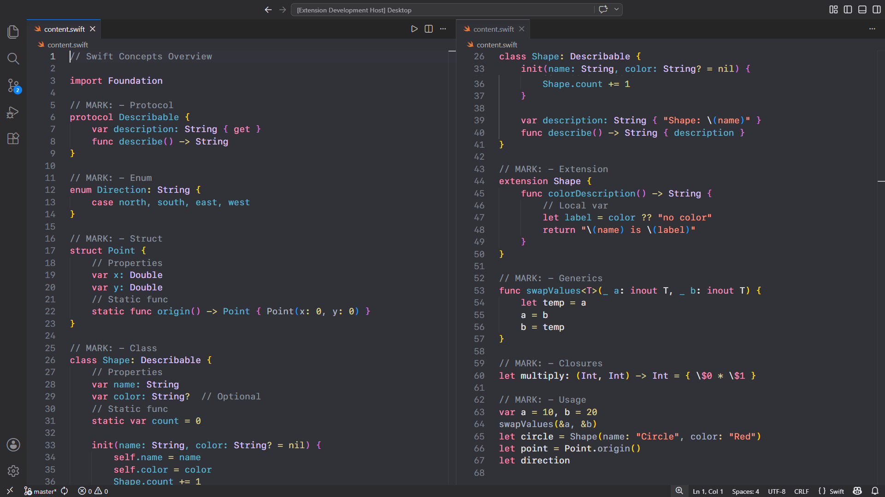
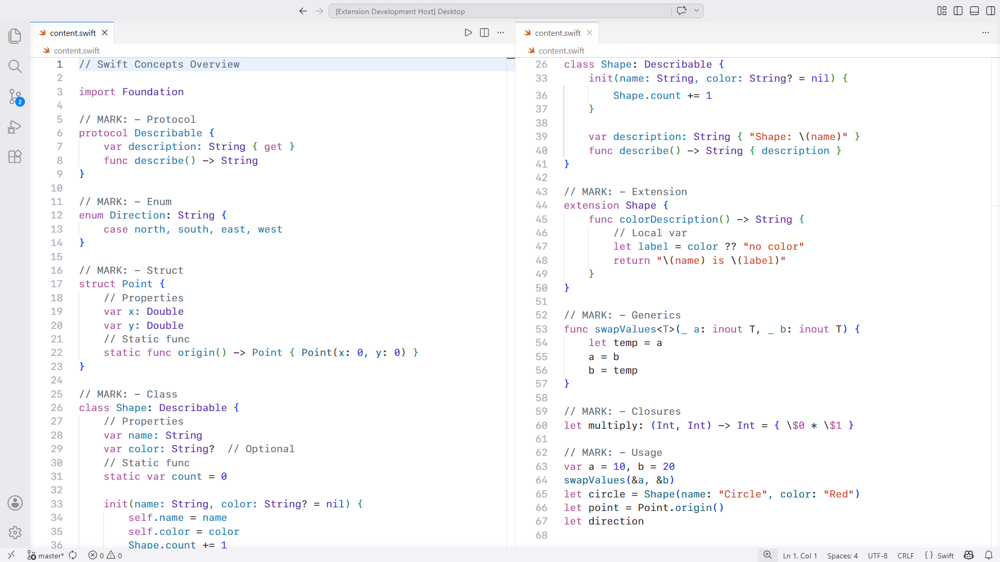

# Xcode 26 Theme

Modern Xcode 26-inspired theme pack for VS Code and Cursor.

This extension includes:

- Xcode 26 Dark
- Xcode 26 Light

Designed to closely match the modern Xcode editor experience with Swift-focused syntax highlighting, semantic token tuning, and accurate Apple-style UI colors.

---

## Features

- Native Xcode-inspired color palette
- Swift semantic + TextMate token customization
- Carefully tuned dark and light variants
- Optimized for Swift, SwiftUI, Objective-C, and Apple development
- Works in both VS Code and Cursor

---

## Recommended Font

For the closest Xcode appearance:

- SF Mono
- Menlo
- Monaco

Example VS Code setting:

```json
"editor.fontFamily": "SF Mono, Menlo, Monaco, monospace"
```

---

## Preview

### Dark



### Light



---

## Installation

### From Marketplace

1. Open Extensions in VS Code or Cursor
2. Search for `Xcode 26 Theme`
3. Install the extension
4. Reload the editor

### From VSIX

Install VSCE:

```bash
npm install -g @vscode/vsce
```

Package the extension:

```bash
vsce package
```

Install the generated `.vsix` file:

- Open Command Palette
- Run: `Extensions: Install from VSIX...`

---

## Usage

1. Open Command Palette
2. Run: `Preferences: Color Theme`
3. Select:
   - `Xcode 26 Dark`
   - `Xcode 26 Light`

---

## Maintainer

Sushant Kumar

---

## License

Apache-2.0